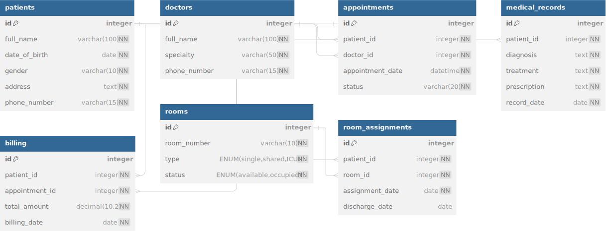

# Hospital Management System Database Schema

## Tables

**Table 1: patients**

- **Primary Key:** id
- **Fields:** full_name, date_of_birth, gender, address, phone_number

**Table 2: doctors**

- **Primary Key:** id
- **Fields:** full_name, specialty, phone_number

**Table 3: appointments**

- **Primary Key:** id
- **Fields:** patient_id, doctor_id, appointment_date, status
- **Indexes:** patient_id, doctor_id

**Table 4: medical_records**

- **Primary Key:** id
- **Fields:** patient_id, diagnosis, treatment, prescription, record_date
- **Indexes:** patient_id

**Table 5: billing**

- **Primary Key:** id
- **Fields:** patient_id, appointment_id, total_amount, billing_date
- **Indexes:** patient_id, appointment_id

**Table 6: rooms**

- **Primary Key:** id
- **Fields:** room_number, type, status
- **Indexes:** room_number

**Table 7: room_assignments**

- **Primary Key:** id
- **Fields:** patient_id, room_id, assignment_date, discharge_date
- **Indexes:** patient_id, room_id

## dbdiagram.io Schema

```sql
Table patients {
  id integer [primary key, increment]
  full_name varchar(100) [not null]
  date_of_birth date [not null]
  gender varchar(10) [not null]
  address text [not null]
  phone_number varchar(15) [not null]

  Indexes {
    id [unique]
  }
}

Table doctors {
  id integer [primary key, increment]
  full_name varchar(100) [not null]
  specialty varchar(50) [not null]
  phone_number varchar(15) [not null]

  Indexes {
    id [unique]
  }
}

Table appointments {
  id integer [primary key, increment]
  patient_id integer [not null, ref: > patients.id]
  doctor_id integer [not null, ref: > doctors.id]
  appointment_date datetime [not null]
  status varchar(20) [not null]

  Indexes {
    id [unique]
    patient_id
    doctor_id
  }
}

Table medical_records {
  id integer [primary key, increment]
  patient_id integer [not null, ref: > patients.id]
  diagnosis text [not null]
  treatment text [not null]
  prescription text [not null]
  record_date date [not null]

  Indexes {
    id [unique]
    patient_id
  }
}

Table billing {
  id integer [primary key, increment]
  patient_id integer [not null, ref: > patients.id]
  appointment_id integer [not null, ref: > appointments.id]
  total_amount decimal(10, 2) [not null]
  billing_date date [not null]

  Indexes {
    id [unique]
    patient_id
    appointment_id
  }
}

Table rooms {
  id integer [primary key, increment]
  room_number varchar(10) [unique, not null]
  type ENUM('single', 'shared', 'ICU') [not null]
  status ENUM('available', 'occupied') [not null]

  Indexes {
    id [unique]
    room_number
    status
  }
}

Table room_assignments {
  id integer [primary key, increment]
  patient_id integer [not null, ref: > patients.id]
  room_id integer [not null, ref: > rooms.id]
  assignment_date date [not null]
  discharge_date date

  Indexes {
    id [unique]
    patient_id
    room_id
  }
}
```

## Image of the Schema

<p align="center">
  
</p>


## Use Case Queries

**Query 1: List all appointments for a specific doctor on a given date:**

```sql
SELECT a.id, p.full_name AS patient_name, a.appointment_date, a.status
FROM appointments a
JOIN patients p ON a.patient_id = p.id
WHERE a.doctor_id = :doctor_id
        AND DATE(a.appointment_date) = :date;
```

**Query 2: Retrieve the medical records for a specific patient:**

```sql
SELECT mr.id, mr.diagnosis, mr.treatment, mr.prescription, mr.record_date
FROM medical_records mr
WHERE mr.patient_id = :patient_id;
```

**Query 3: Find the total amount billed to a specific patient:**

```sql
SELECT SUM(b.total_amount) AS total_billed
FROM billing b
WHERE b.patient_id = :patient_id;
```

**Query 4: List all available rooms of a specific type:**

```sql
SELECT r.room_number
FROM rooms r
WHERE r.type = :room_type
        AND r.status = 'available';
```

**Query 5: Calculate the average length of stay for patients in the hospital:**

```sql
SELECT AVG(DATEDIFF(ra.discharge_date, ra.assignment_date)) AS average_length_of_stay
FROM room_assignments ra;
```

**Query 6: List all patients currently admitted to the hospital:**

```sql
SELECT p.full_name, ra.assignment_date, r.room_number, r.type
FROM room_assignments ra
JOIN patients p ON ra.patient_id = p.id
JOIN rooms r ON ra.room_id = r.id
WHERE ra.discharge_date IS NULL;
```
